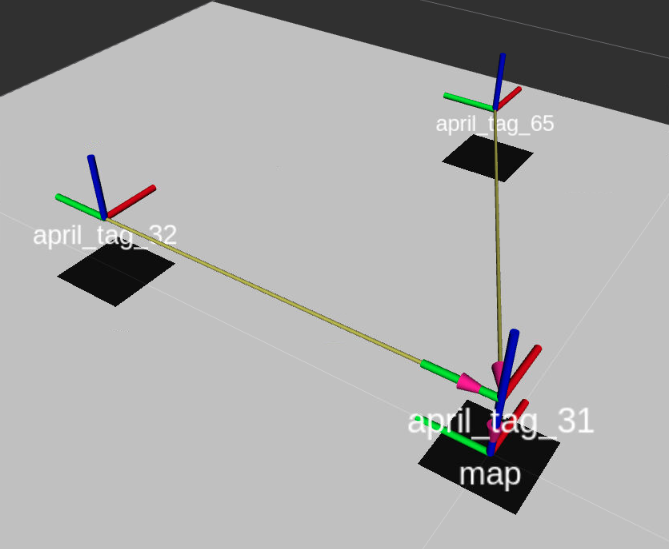

# Overview of cse571-sp21-project-1 repository

### cse571-sp21-project-1 repo contains four packages that you won't have to modify:
- `my_at_localization` that localizes the AprilTAGs seen by the robot
- `my_static_tf` that publishes coordinate transforms (position and orientation) of all the landmarks in predetermined maps. These coordinate frames are in the form of ROS `\tf` messages
- `my_viz` that can publish map information and path traced by the robot in a visualizer (ROS visualizer called RViz).
- `image_processing` that contains utility functions to process images.

### cse571-sp21-project-1 repo contains TODO packages that you will have to edit in order to complete the project:
- `my_kf_localization` that localizes the robot based on the velocity control and AprilTAG localization.

You can see them in the `./packages/` path.
The source code for each of these packages are inside their respective `src/` folders. For example for `my_at_localization` you will see the source code in the path `./packages/my_at_localization/src/`.

### (Recommended exercies) To understand the folder structure and how to create new packages, build and run the packages on local as well as on robot, please see the [documentation](https://docs.duckietown.org/daffy/duckietown-robotics-development/out/dt_infrastructure.html).

## [TASK 1] Build the provided packages, run it on the robot, record what you can visualize.
After completing project 0.5. You must be able to communicate with your robot from your local computer using `dts shell`

### 1. Clone the cse571-sp21-project-1 repository on to your local computer
`git clone https://github.com/fishbotics/cse571-sp21-project-1.git
cd cse571-sp21-project-1`

### 2. Build the above mentioned packages on the duckiebot
`dts devel build -f -H {ROBOT_NAME}.local` from the `{PATH}\cse571-sp21-project-1` folder.

### 3. Run the packages on the duckiebot.
`dts devel run -H {ROBOT_NAME}.local` from the `{PATH}\cse571-sp21-project-1` folder.

### 4. Visualize what is happening by logging into the robot with the below command.
`dts start_gui_tools --vnc ROBOT_NAME` and open `http://localhost:8087/`
Open the Rviz, add `\tf` from the panel.

[Here is the video of what it will look like](https://drive.google.com/file/d/1f476TsCCE0Qec0i8Z3L4r3IU_1kj-CZV/view?usp=sharing)

### 5. Record a screen recording of what you can visualize using Rviz and other tools (similar to above).

### (Note) How did the run command know what to run? Change what you are launching with the above run command.
By default, the above command will launch the package(s) indicated in the `./launchers/default.sh` file. 
Be sure to follow these [instructions](https://docs.duckietown.org/daffy/duckietown-robotics-development/out/dt_infrastructure.html) in order to build. You cannot build this on your desktop using the typical `docker build` workflow. 

## [TASK 2] Create a physical map-1 using duckietown supplies

### 1. Create a map in your environment that looks and measures like below. Note that consistent height of the tag center to the base of the stand will avoid noise in the estimation.

### 2. Understanding the coordinate frames in the map (both physical as well as what is visualized in the RViz).
In RViz, coordinate frames are colored with x in red, y in green and z in blue. For map-1, AprilTAG-31 (AT-31) is the global origin frame. map-1 has two other tags (AT-32 and AT-65) with fixed transformation with respect to the map frame. `my_static_tf` package runs by default from the `./launchers/default.sh` to publish `\tf` tree that you can see in RViz. So overall, you can select 4 transforms (`map`, `april_tag_31`, `april_tag_32`, `april_tag_65`) in RViz to see the map. 

### 3. Understanding the measurements published in the map frame.
It is important to understand the TF tree.
- When the robot detects an AT, a transform is published linking `april_tag_{id}` to its internal pose as read by the camera `april_tag_cam_{id}`. 
- Another transform links `april_tag_cam_{id}` and `at_{id}_camera_rgb_link` (which is the internal transform of the camera). 
- Another transform links the internal camera to its physical location via `at_{id}_camera_rgb_link` to `at_{id}_camera_link`. 
- Using the design of the robot, we can get the transform between `at_{id}_camera_link` to the base of the robot `at_{id}_base_link`. 

Notice that all of these transforms is specific to a AprilTAG. This is the measurement we provide you when a robot detects an AprilTAG. At the end of the Task 1, you should be able to visualize these transforms in RViz. Move the robot around and see how these transforms change. You can also change the visualization's global frame from \map to any other frame using the "Global options" -> "Fixed frame" in RViz.

## [TASK 3] Implement `my_kf_localization` package and test on map-1.
[TODO] Adam

## [TASK 4] Create a physical map-2 using duckietown supplies

### 1. Create a map in your environment that looks and measures like below. Note that consistent height of the tag center to the base of the stand will avoid noise in the estimation.

[TODO] Junha to give the map and Karthik to run and test and document here.

## [TASK 5] Test `my_kf_localization` package on map-2.
[TODO] Adam

# Additional Documentation from Template:
### 1. Define dependencies

List the dependencies in the files `dependencies-apt.txt` and
`dependencies-py3.txt` (apt packages and pip packages respectively).

### 2. Place your code

Place your code in the directory `/packages/` of
your new repository.

### 3. Setup launchers

The directory `/launchers` can contain as many launchers (launching scripts)
as you want. A default launcher called `default.sh` must always be present.

If you create an executable script (i.e., a file with a valid shebang statement)
a launcher will be created for it. For example, the script file 
`/launchers/my-launcher.sh` will be available inside the Docker image as the binary
`dt-launcher-my-launcher`.

When launching a new container, you can simply provide `dt-launcher-my-launcher` as
command.
